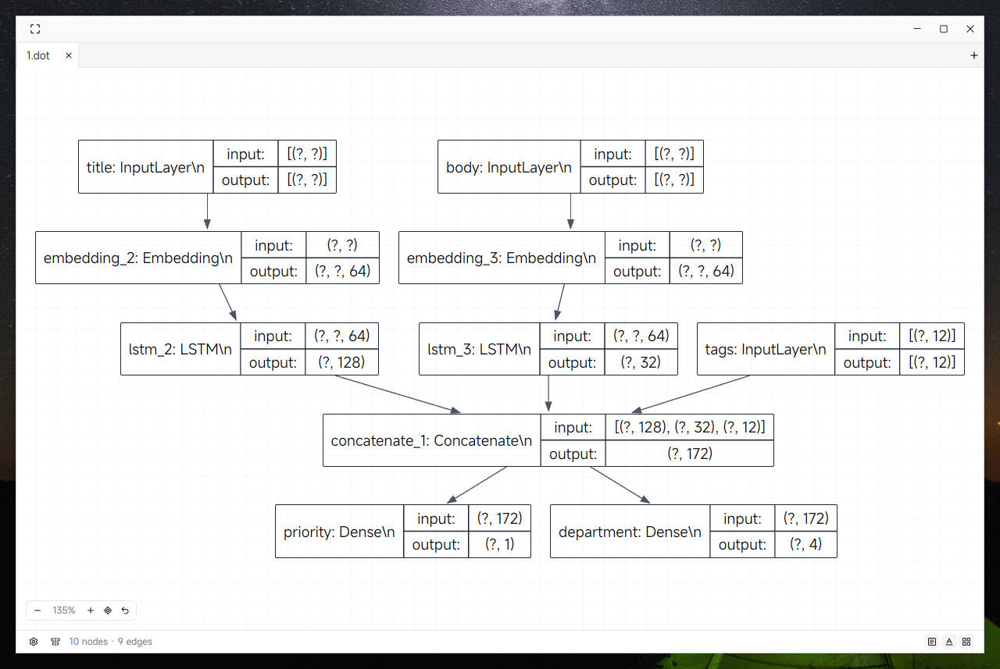

# dotv — a DOT graph viewer with a Graphviz-compatible `dot` engine

<p align="center">
  
</p>

`dotv` renders Graphviz DOT files in a native desktop window. Its layout
engine is a faithful Rust port of Graphviz' `dot`, so drawings match what
`dot` itself would produce; the UI is built with GPUI and GPUI Kit, and the
MiSans Latin typeface is embedded, so it renders identically on every
machine.

## Features

- **Graphviz-compatible layout** — ranks, crossing minimization, spline edge
  routing, arrowheads, node shapes, clusters and ports all follow the
  original `dot` algorithms (verified against real Graphviz, see
  [docs/architecture.md](docs/architecture.md));
- **Interactive viewer** — pan, cursor-anchored zoom, drag nodes with live
  edge re-routing, hover to inspect, fit to window, and a fullscreen mode
  (`F11` or the title-bar button, `Esc` exits) that shows only the graph;
- **Multiple documents at once** — every opened file gets its own tab with
  independent pan/zoom/selection; switch with `Ctrl+Tab` / `Ctrl+Shift+Tab`,
  close with `Ctrl+W`. Files open from the dialog (`Ctrl+O`), by dragging
  them onto the window, or by pasting a file path (`Ctrl+V` — the reliable
  route when running under WSLg, which does not forward cross-system file
  drags);
- **Settings** — node/edge labels, background grid, natural scrolling,
  layout direction (TB↔LR) and label scale, from the status bar (the gear
  on its left edge and the toggles beside it);
- **Headless modes** — export the layout as JSON or SVG without a window;
- **No runtime dependencies** — the font and every icon are compiled into
  the binary.

## Build

Requires a recent Rust toolchain (the crate uses edition 2024; development
happens on nightly).

```bash
cargo build --release   # binary at target/release/dotv
cargo run --release -- 1.dot
```

## Command line

| Command | What it does |
| --- | --- |
| `dotv [file.dot]` | Open a graph in the viewer; with no file, start empty (`Ctrl+O` picks one) |
| `dotv --dump graph.dot` | Headless: print the layout (ranks, node boxes, edge geometry) as JSON |
| `dotv --dump graph.dot --sizes sizes.plain` | Headless: same, but node sizes come from a `dot -Tplain` file (inches) |
| `dotv --svg graph.dot out.svg` | Headless: export the drawing as SVG (omit `out.svg` to print to stdout) |

`dotv --help` lists every flag. The headless modes never open a window, so
they run in scripts and CI.

## Viewer interactions

| Action | How |
| --- | --- |
| Open file | `Ctrl+O`, or pass a file on the command line |
| Settings | Title-bar gear (node labels / edge labels / grid / natural scrolling / direction TB–LR / label scale) |
| Zoom in / out | `Ctrl+=` / `Ctrl+-` |
| Fit to window | `Ctrl+0`; also runs once after opening a file |
| Clear selection | `Esc` |
| Pan | Drag on empty space, or mouse wheel |
| Zoom | `Ctrl`/`⌘` + wheel (anchored at the cursor), or the floating zoom cluster (+/−, fit, reset) |
| Select node | Click a node (highlighted in the primary color) |
| Move nodes | Drag a node; the drop position snaps to a lattice vertex and every edge touching it is re-routed live (arrows rebuilt). The undo button in the zoom cluster snaps everything back |
| Inspect a node | Hover for a tooltip with the label, id and attributes |
| Status bar | Node/edge counts, the selected node, and quick toggles (node labels, edge labels, grid, TB↔LR) |

## Supported DOT input

`rankdir=TB|LR|BT|RL`, `rank=same|min|max|source|sink`, `newrank`,
`concentrate`, clusters (nested, with labels), self loops, parallel edges,
flat edges, `splines=line` and `splines=polyline`, all arrow types,
`headport`/`tailport` (compass and record-field ports), `samehead`/`sametail`,
the builtin node shapes incl. record shapes, `style`
(filled/rounded/dashed/dotted/invis), `penwidth`, `arrowsize`,
`nodesep`/`ranksep`, colors (X11 names, `#rrggbb`, HSV) and `bgcolor`.

Known limitations: `splines=ortho` falls back to polyline routing; head/tail
port labels (`labelangle`/`labeldistance`) are not drawn; flat edges between
adjacent nodes with ports use a simple spline. The full porting status,
including what is still missing from the C original, is in
[docs/architecture.md](docs/architecture.md).

## Documentation

- [docs/architecture.md](docs/architecture.md) — engine internals, module
  map, text-measurement pipeline and the Graphviz verification setup;
- [docs/graphviz-specs/](docs/graphviz-specs/) — per-file specs of the C
  sources the engine was ported from (line-referenced).
